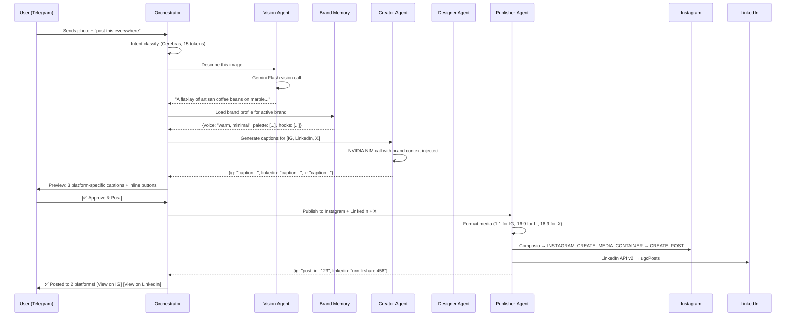
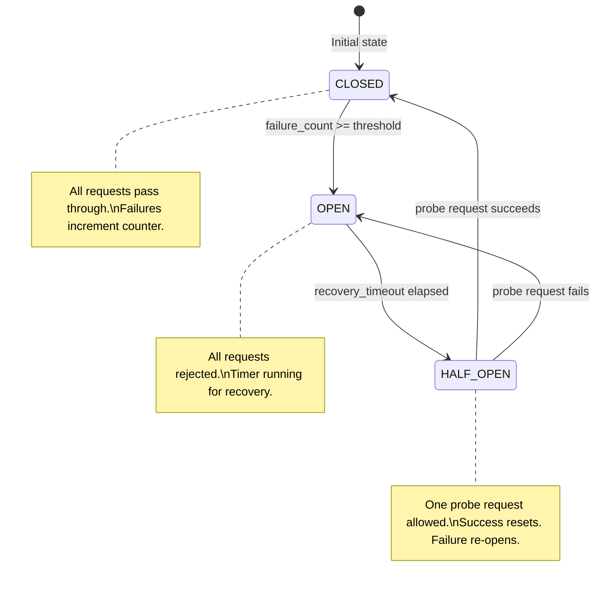
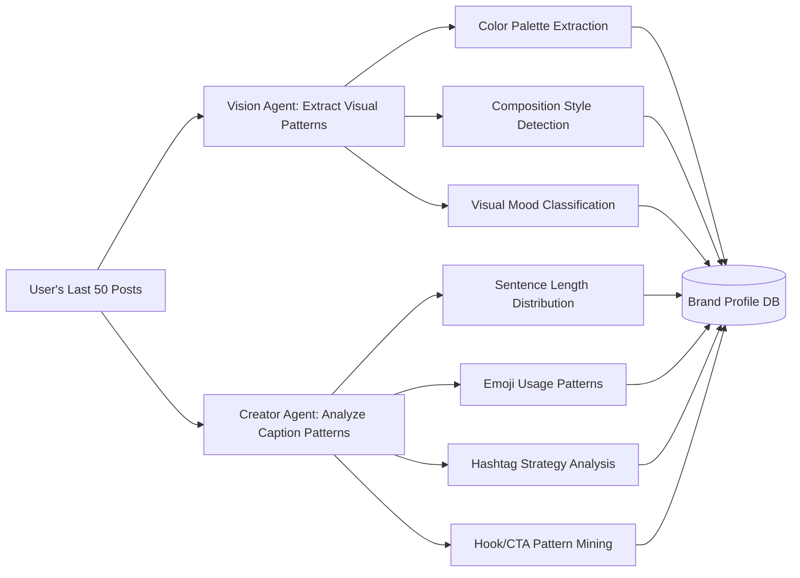
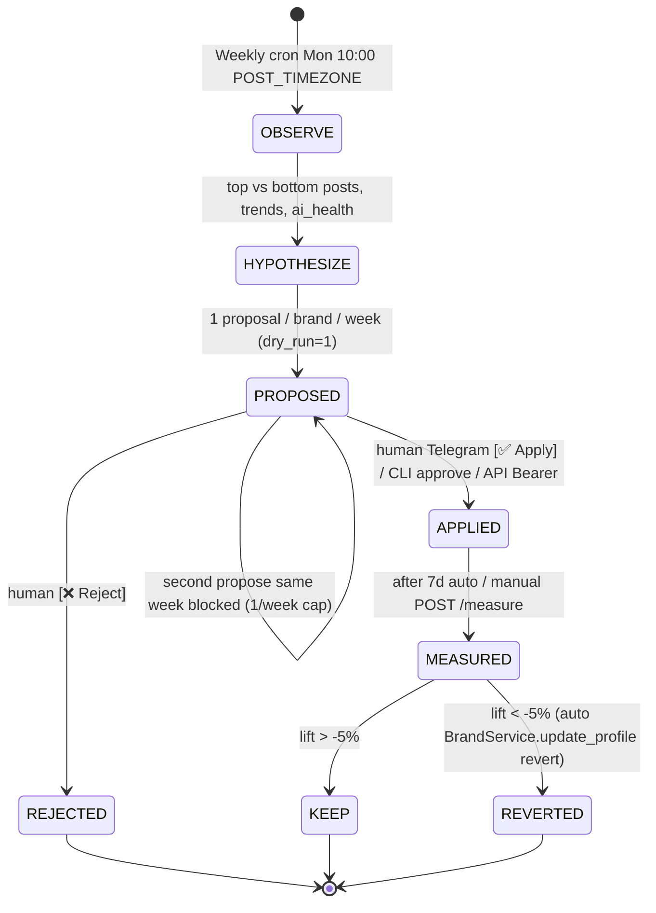

# Technical Specification Sheet — ClawAgent v3.1

**Document Version:** 3.1.0  
**Codename:** ClawAgent — Self-Improving Loop  
**Author:** Swarit Sharma / Uniconverge Technologies Pvt. Ltd.  
**Last Updated:** 2026-08-28  

---

## 1. System Architecture

### 1.1 High-Level Architecture

```mermaid
graph TD
    subgraph User Interface Layer
        TG([Telegram Bot])
        WEB([Web Dashboard - Future])
        API([REST API - Future])
    end

    subgraph Orchestration Layer
        GW[Gateway & Intent Classifier]
        ORCH[Orchestrator Agent]
        BM[Brand Memory Manager]
    end

    subgraph Specialist Agent Pool
        CREATOR[🎨 Creator Agent]
        VISION[👁️ Vision Agent]
        ANALYST[📊 Analyst Agent]
        RESEARCH[🔍 Research Agent]
        DESIGNER[🖼️ Designer Agent]
        SCHEDULER[📅 Scheduler Agent]
        PUBLISHER[📤 Publisher Agent]
    end

    subgraph Model Stack - Hot Swappable
        MR[Model Registry & Router]
        CB{Circuit Breaker}
        MR --> CB
        CB --> P_CEREBRAS[Cerebras - Free]
        CB --> P_NVIDIA[NVIDIA NIM - Free]
        CB --> P_GEMINI[Gemini Flash/Pro - Free]
        CB --> P_MISTRAL[Mistral - Free]
        CB --> P_POLLINATIONS[Pollinations - Free]
        CB --> P_BANANA[Banana.dev - Paid Optional]
        CB --> P_OPENAI[OpenAI - Paid Optional]
        CB --> P_REPLICATE[Replicate - Paid Optional]
        CB --> P_OLLAMA[Ollama Local - Free]
    end

    subgraph Platform Adapters
        IG[Instagram Adapter]
        LI[LinkedIn Adapter]
        TW[X/Twitter Adapter]
        YT[YouTube Adapter]
        FB[Facebook Adapter]
        TH[Threads Adapter]
    end

    subgraph Intelligence Layer
        COMP[Competitor Monitor]
        TREND[Trend Detector]
        PERF[Performance Learner]
        SELF[🧬 Self-Improving Loop<br/>Observe→Hypothesize→Propose→Approve→Measure]
    end

    subgraph Persistence Layer
        DB[(SQLite / PostgreSQL)]
        CACHE[(Redis Cache - Optional)]
        CDN[Media CDN: imgbb / Cloudinary / S3]
        BRAND[(Brand Profiles & Voice Vectors)]
        IMPROVE[(improvement_log<br/>Audit & L1/L3 Gates)]
    end

    TG --> GW
    WEB --> GW
    API --> GW
    GW --> ORCH
    ORCH --> BM
    BM --> BRAND
    ORCH --> CREATOR
    ORCH --> VISION
    ORCH --> ANALYST
    ORCH --> RESEARCH
    ORCH --> DESIGNER
    ORCH --> SCHEDULER
    ORCH --> PUBLISHER
    CREATOR --> MR
    VISION --> MR
    ANALYST --> MR
    RESEARCH --> MR
    DESIGNER --> MR
    PUBLISHER --> IG
    PUBLISHER --> LI
    PUBLISHER --> TW
    PUBLISHER --> YT
    PUBLISHER --> FB
    PUBLISHER --> TH
    RESEARCH --> COMP
    RESEARCH --> TREND
    ANALYST --> PERF
    PERF --> SELF
    SELF --> BM
    SELF --> DB
    SELF --> IMPROVE
    PUBLISHER --> CDN
    ORCH --> DB
    SCHEDULER --> CACHE
    ANALYST -.-> SELF
```



### 1.2 Process Flow — Post Creation



---

## 2. Model Stack & Provider Specifications

### 2.1 Provider Registry Schema

Location: `config/models.yaml`

```yaml
version: 3
hot_reload: true
reload_interval_seconds: 5

# Which provider handles which task type by default
defaults:
  orchestration: cerebras       # Cheapest, fastest — used on EVERY message
  creative_writing: nvidia      # Strong instruction-following
  vision: gemini_flash          # Best free multimodal model
  reasoning: mistral            # Deep analysis
  deep_analysis: gemini_pro     # Complex multi-step reasoning
  image_generation: pollinations # No API key, unlimited
  fast_formatting: cerebras     # Structured output, JSON

providers:
  cerebras:
    type: openai_compatible
    base_url: https://api.cerebras.ai/v1
    api_key_env: CEREBRAS_API_KEY
    model: gpt-oss-120b
    capabilities: [text, fast_formatting, orchestration]
    cost_tier: free
    limits:
      tokens_per_day: 1000000
      rpm: 60
    health_check:
      endpoint: /v1/models
      interval_seconds: 300
    circuit_breaker:
      failure_threshold: 3
      recovery_timeout_seconds: 60

  nvidia:
    type: openai_compatible
    base_url: https://integrate.api.nvidia.com/v1
    api_key_env: NVIDIA_API_KEY
    model: z-ai/glm-5.2
    capabilities: [text, creative_writing]
    cost_tier: free
    limits:
      rpm: 40
      credits: 1000
    circuit_breaker:
      failure_threshold: 3
      recovery_timeout_seconds: 120

  gemini_flash:
    type: google_genai
    api_key_env: GEMINI_API_KEY
    model: gemini-2.5-flash
    capabilities: [text, vision, reasoning, creative_writing]
    cost_tier: free
    limits:
      rpd: 1500
      rpm: 15
    circuit_breaker:
      failure_threshold: 5
      recovery_timeout_seconds: 60

  gemini_pro:
    type: google_genai
    api_key_env: GEMINI_API_KEY
    model: gemini-2.5-pro
    capabilities: [reasoning, deep_analysis]
    cost_tier: free
    limits:
      rpd: 25
    circuit_breaker:
      failure_threshold: 2
      recovery_timeout_seconds: 300

  mistral:
    type: openai_compatible
    base_url: https://api.mistral.ai/v1
    api_key_env: MISTRAL_API_KEY
    model: mistral-large-latest
    capabilities: [text, creative_writing, reasoning]
    cost_tier: free
    limits:
      tokens_per_month: 1000000000
    circuit_breaker:
      failure_threshold: 3
      recovery_timeout_seconds: 120

  pollinations:
    type: pollinations
    base_url: https://image.pollinations.ai
    model: flux
    capabilities: [image_generation]
    cost_tier: free
    limits:
      rpm: 10

  # ---- OPTIONAL PAID PROVIDERS (disabled by default) ----
  banana_dev:
    type: banana
    base_url: https://api.banana.dev/v1
    api_key_env: BANANA_API_KEY
    model: flux-1-dev
    capabilities: [image_generation]
    cost_tier: paid
    enabled: false

  replicate:
    type: replicate
    base_url: https://api.replicate.com/v1
    api_key_env: REPLICATE_API_TOKEN
    model: black-forest-labs/flux-schnell
    capabilities: [image_generation]
    cost_tier: paid
    enabled: false

  openai:
    type: openai
    base_url: https://api.openai.com/v1
    api_key_env: OPENAI_API_KEY
    model: gpt-4o-mini
    capabilities: [text, vision, creative_writing, reasoning]
    cost_tier: paid
    enabled: false

  ollama:
    type: openai_compatible
    base_url: http://localhost:11434/v1
    api_key_env: OLLAMA_PLACEHOLDER
    model: llama3.2
    capabilities: [text, creative_writing]
    cost_tier: free
    enabled: false
    note: "For local-first / privacy-sensitive deployments"

# Ordered fallback chains per task type
fallback_chains:
  orchestration: [cerebras, gemini_flash, nvidia, mistral]
  creative_writing: [nvidia, mistral, gemini_flash, cerebras, openai]
  vision: [gemini_flash, openai]
  reasoning: [mistral, gemini_pro, gemini_flash, openai]
  deep_analysis: [gemini_pro, mistral, openai]
  image_generation: [pollinations, banana_dev, replicate]
  fast_formatting: [cerebras, gemini_flash, nvidia]
```

### 2.2 Model Router Implementation

```python
class ModelRouter:
    """
    Task-based model routing with circuit breakers and hot-reload.
    
    Design principles:
    1. Task classification happens on the cheapest model (Cerebras).
    2. Each task type routes to the best-suited model.
    3. Circuit breakers prevent cascading failures.
    4. Config is hot-reloaded from YAML without restart.
    """
    
    def __init__(self, config_path="config/models.yaml"):
        self.config_path = config_path
        self.config = self._load_config()
        self.circuit_breakers: Dict[str, CircuitBreaker] = {}
        self._start_file_watcher()
    
    def route(self, task_type: str) -> ProviderClient:
        """Route a task to the best available provider."""
        chain = self.config['fallback_chains'].get(task_type, [])
        
        for provider_name in chain:
            provider = self.config['providers'].get(provider_name)
            if not provider or not provider.get('enabled', True):
                continue
            
            cb = self._get_circuit_breaker(provider_name)
            if cb.is_open:
                continue  # Skip providers in failure state
            
            if not self._has_api_key(provider):
                continue  # Skip providers without configured keys
            
            return self._build_client(provider_name, provider)
        
        raise AllProvidersExhausted(f"No providers available for task: {task_type}")
    
    def _start_file_watcher(self):
        """Watch config/models.yaml for changes and hot-reload."""
        # watchdog Observer on self.config_path
        # On modification event: self.config = self._load_config()
        pass
```

### 2.3 Circuit Breaker State Machine



---

## 3. Database Schema (Complete DDL)

### 3.1 Core Tables (Upgraded from v1)

```sql
-- ============================================================
-- BRAND & IDENTITY
-- ============================================================

CREATE TABLE IF NOT EXISTS brands (
    id INTEGER PRIMARY KEY AUTOINCREMENT,
    name TEXT NOT NULL UNIQUE,
    is_active BOOLEAN DEFAULT 0,
    
    -- Visual Identity
    color_palette JSON,               -- ["#FF5733", "#1A1A1A", "#FFFFFF"]
    typography_style TEXT,            -- "modern-sans", "classic-serif"
    visual_mood TEXT,                 -- "minimalist, warm, earthy"
    logo_url TEXT,
    
    -- Voice & Tone
    tone_of_voice TEXT,               -- "friendly, authoritative, witty"
    avg_sentence_length REAL,         -- Learned from past captions
    emoji_frequency REAL,             -- Emojis per caption (0.0 - 5.0)
    emoji_style TEXT,                 -- "heavy", "minimal", "none"
    hashtag_count_range TEXT,         -- "5-7"
    prohibited_words TEXT,            -- "synergy, leverage, disrupt"
    mandatory_elements TEXT,          -- "Always end with a question"
    sample_hooks JSON,               -- ["Did you know...", "Here's the truth:"]
    
    -- Platform Accounts
    instagram_user_id TEXT,
    linkedin_urn TEXT,
    twitter_handle TEXT,
    youtube_channel_id TEXT,
    
    -- Composio / Auth
    composio_account_id TEXT,
    
    created_at DATETIME DEFAULT CURRENT_TIMESTAMP,
    updated_at DATETIME DEFAULT CURRENT_TIMESTAMP
);

-- ============================================================
-- MULTI-PLATFORM CONTENT
-- ============================================================

CREATE TABLE IF NOT EXISTS campaigns (
    id INTEGER PRIMARY KEY AUTOINCREMENT,
    brand_id INTEGER REFERENCES brands(id),
    title TEXT,
    description TEXT,
    source_content TEXT,             -- Original long-form content for repurposing
    status TEXT DEFAULT 'DRAFT',     -- DRAFT, SCHEDULED, PARTIALLY_POSTED, COMPLETED
    created_at DATETIME DEFAULT CURRENT_TIMESTAMP
);

CREATE TABLE IF NOT EXISTS posts (
    id INTEGER PRIMARY KEY AUTOINCREMENT,
    campaign_id INTEGER REFERENCES campaigns(id),
    brand_id INTEGER REFERENCES brands(id),
    
    -- Content
    platform TEXT NOT NULL,          -- INSTAGRAM, LINKEDIN, TWITTER, YOUTUBE, FACEBOOK
    post_type TEXT,                  -- FEED, REEL, STORY, CAROUSEL, THREAD, SHORT, ARTICLE
    caption TEXT,
    alt_text TEXT,                   -- Accessibility: auto-generated image description
    media_urls JSON,                 -- ["https://cdn.example.com/img1.jpg"]
    media_format TEXT,               -- "1:1", "4:5", "9:16", "16:9"
    
    -- AI Metadata
    caption_provider TEXT,           -- Which model wrote the caption
    vision_provider TEXT,            -- Which model described the image
    image_gen_provider TEXT,         -- Which model generated the image (if AI-generated)
    brand_compliance_score REAL,     -- 0.0 to 1.0, how well it matches brand profile
    
    -- Publishing
    platform_post_id TEXT,           -- Instagram post ID, LinkedIn URN, Tweet ID
    status TEXT DEFAULT 'PENDING',   -- PENDING, APPROVED, POSTED, FAILED, REJECTED
    scheduled_time DATETIME,
    posted_at DATETIME,
    
    -- Engagement (updated by analytics pipeline)
    reach INTEGER DEFAULT 0,
    impressions INTEGER DEFAULT 0,
    likes INTEGER DEFAULT 0,
    comments INTEGER DEFAULT 0,
    shares INTEGER DEFAULT 0,
    saves INTEGER DEFAULT 0,
    engagement_rate REAL DEFAULT 0.0,
    
    created_at DATETIME DEFAULT CURRENT_TIMESTAMP
);

CREATE TABLE IF NOT EXISTS drafts (
    id INTEGER PRIMARY KEY AUTOINCREMENT,
    brand_id INTEGER REFERENCES brands(id),
    
    -- Content variants (for A/B testing)
    caption_variants JSON,           -- ["caption A", "caption B", "caption C"]
    selected_variant INTEGER DEFAULT 0,
    
    media_urls JSON,
    tone TEXT,
    platforms JSON,                  -- ["INSTAGRAM", "LINKEDIN"]
    media_type TEXT,
    status TEXT DEFAULT 'PENDING',   -- PENDING, APPROVED, REJECTED
    
    created_at DATETIME DEFAULT CURRENT_TIMESTAMP
);

-- ============================================================
-- COMPETITOR & TREND INTELLIGENCE
-- ============================================================

CREATE TABLE IF NOT EXISTS competitors (
    id INTEGER PRIMARY KEY AUTOINCREMENT,
    brand_id INTEGER REFERENCES brands(id),
    platform TEXT NOT NULL,
    handle TEXT NOT NULL,
    follower_count INTEGER,
    avg_engagement_rate REAL,
    last_scraped_at DATETIME,
    UNIQUE(brand_id, platform, handle)
);

CREATE TABLE IF NOT EXISTS competitor_posts (
    id INTEGER PRIMARY KEY AUTOINCREMENT,
    competitor_id INTEGER REFERENCES competitors(id),
    platform_post_id TEXT,
    post_type TEXT,
    caption_summary TEXT,            -- AI-summarized caption themes
    estimated_engagement REAL,
    posted_at DATETIME,
    scraped_at DATETIME DEFAULT CURRENT_TIMESTAMP
);

CREATE TABLE IF NOT EXISTS trend_insights (
    id INTEGER PRIMARY KEY AUTOINCREMENT,
    brand_id INTEGER REFERENCES brands(id),
    topic TEXT NOT NULL,
    relevance_score REAL,            -- 0.0 to 1.0
    source TEXT,                     -- GOOGLE_TRENDS, X_TRENDS, IG_HASHTAGS
    trend_velocity TEXT,             -- RISING, STABLE, DECLINING
    suggested_content JSON,          -- [{angle: "...", platform: "IG", format: "CAROUSEL"}]
    expires_at DATETIME,             -- Trends are perishable
    created_at DATETIME DEFAULT CURRENT_TIMESTAMP
);

CREATE TABLE IF NOT EXISTS content_ideas (
    id INTEGER PRIMARY KEY AUTOINCREMENT,
    brand_id INTEGER REFERENCES brands(id),
    week_number INTEGER,
    idea_text TEXT,
    draft_caption TEXT,
    suggested_media TEXT,            -- "photo of...", "carousel with..."
    target_platform TEXT,
    source_trend_id INTEGER REFERENCES trend_insights(id),
    status TEXT DEFAULT 'SUGGESTED', -- SUGGESTED, ACCEPTED, CREATED, DISMISSED
    created_at DATETIME DEFAULT CURRENT_TIMESTAMP
);

-- ============================================================
-- AI OPERATIONS & OBSERVABILITY
-- ============================================================

CREATE TABLE IF NOT EXISTS ai_calls (
    id INTEGER PRIMARY KEY AUTOINCREMENT,
    provider TEXT NOT NULL,
    model TEXT,
    task_type TEXT,                   -- orchestration, creative_writing, vision, etc.
    success BOOLEAN,
    latency_ms INTEGER,
    input_tokens INTEGER,
    output_tokens INTEGER,
    error_message TEXT,
    brand_id INTEGER REFERENCES brands(id),
    timestamp DATETIME DEFAULT CURRENT_TIMESTAMP
);

CREATE TABLE IF NOT EXISTS circuit_breaker_events (
    id INTEGER PRIMARY KEY AUTOINCREMENT,
    provider TEXT NOT NULL,
    event_type TEXT,                  -- OPENED, HALF_OPENED, CLOSED, PROBE_SUCCESS, PROBE_FAIL
    failure_count INTEGER,
    timestamp DATETIME DEFAULT CURRENT_TIMESTAMP
);

-- ============================================================
-- SCHEDULING & QUEUE
-- ============================================================

CREATE TABLE IF NOT EXISTS scheduled_posts (
    id INTEGER PRIMARY KEY AUTOINCREMENT,
    post_id INTEGER REFERENCES posts(id),
    brand_id INTEGER REFERENCES brands(id),
    scheduled_time_utc DATETIME NOT NULL,
    user_timezone TEXT DEFAULT 'UTC',
    optimal_time_suggested BOOLEAN DEFAULT 0,  -- Was this time AI-suggested?
    status TEXT DEFAULT 'PENDING',    -- PENDING, PUBLISHED, FAILED, CANCELLED
    retry_count INTEGER DEFAULT 0,
    last_error TEXT,
    created_at DATETIME DEFAULT CURRENT_TIMESTAMP
);

-- ============================================================
-- DM & ENGAGEMENT TRACKING
-- ============================================================

CREATE TABLE IF NOT EXISTS seen_dms (
    conversation_id TEXT PRIMARY KEY,
    platform TEXT DEFAULT 'INSTAGRAM',
    brand_id INTEGER REFERENCES brands(id),
    seen_at DATETIME DEFAULT CURRENT_TIMESTAMP
);

CREATE TABLE IF NOT EXISTS engagement_log (
    id INTEGER PRIMARY KEY AUTOINCREMENT,
    brand_id INTEGER REFERENCES brands(id),
    platform TEXT,
    event_type TEXT,                  -- NEW_DM, NEW_COMMENT, NEW_FOLLOWER, MENTION
    event_data JSON,
    sentiment TEXT,                   -- POSITIVE, NEUTRAL, NEGATIVE (AI-classified)
    notified BOOLEAN DEFAULT 0,
    created_at DATETIME DEFAULT CURRENT_TIMESTAMP
);

-- ============================================================
-- SELF-IMPROVING LOOP (v3.1)
-- ============================================================

CREATE TABLE IF NOT EXISTS improvement_log (
    id INTEGER PRIMARY KEY AUTOINCREMENT,
    brand_id INTEGER REFERENCES brands(id),
    week_number INTEGER,                -- ISO week
    experiment_type TEXT DEFAULT 'L1_HOOK', -- L1_HASHTAG, L1_READABILITY, L1_HOOK, L1_NONE
    hypothesis TEXT,                    -- 2-sentence why + predicted lift
    changed_field TEXT,                 -- ALLOWED_FIELDS: hashtag_count_range, sample_hooks, avg_sentence_length, emoji_frequency; L3 gated: tone_of_voice
    old_value TEXT,
    new_value TEXT,
    metric_before REAL,                 -- avg engagement_rate 14d before
    metric_after REAL,                  -- avg 7d after APPLIED
    predicted_lift REAL DEFAULT 0.0,    -- 0.05-0.25
    status TEXT DEFAULT 'PROPOSED',     -- PROPOSED, APPLIED, REJECTED, MEASURED, REVERTED
    dry_run BOOLEAN DEFAULT 1,          -- 1=dry-run needs human, 0=applied
    created_at DATETIME DEFAULT CURRENT_TIMESTAMP,
    applied_at DATETIME,
    measured_at DATETIME
);
```

---

## 4. Platform Adapter Specifications

### 4.1 Adapter Interface Contract

```python
from abc import ABC, abstractmethod
from dataclasses import dataclass
from typing import List, Optional

@dataclass
class MediaSpec:
    """Platform-specific media requirements"""
    aspect_ratios: List[str]         # ["1:1", "4:5", "9:16"]
    max_file_size_mb: float
    supported_formats: List[str]     # ["jpg", "png", "mp4"]
    max_caption_length: int
    max_hashtags: int
    max_images_carousel: int

@dataclass
class PublishResult:
    success: bool
    platform_post_id: Optional[str]
    permalink: Optional[str]
    error: Optional[str]

class PlatformAdapter(ABC):
    
    @abstractmethod
    def get_media_spec(self, post_type: str) -> MediaSpec:
        """Return platform constraints for this post type."""
        pass
    
    @abstractmethod
    def format_caption(self, raw_caption: str, brand_profile: dict) -> str:
        """Adapt caption to platform norms (length, hashtag rules, etc.)."""
        pass
    
    @abstractmethod
    def publish(self, content: dict) -> PublishResult:
        """Publish content to the platform."""
        pass
    
    @abstractmethod
    def get_analytics(self, date_range: tuple) -> dict:
        """Fetch performance data for date range."""
        pass
```

### 4.2 Platform Media Specifications

| Platform | Post Type | Aspect Ratios | Max Caption | Max Hashtags | Max Media | API |
|---|---|---|---|---|---|---|
| **Instagram** | Feed | 1:1, 4:5 | 2200 chars | 30 (rec. 5-7) | 1 image | Composio MCP |
| **Instagram** | Reel | 9:16 | 2200 chars | 30 | 1 video (< 90s) | Composio MCP |
| **Instagram** | Story | 9:16 | N/A | N/A | 1 image/video | Composio MCP |
| **Instagram** | Carousel | 1:1, 4:5 | 2200 chars | 30 | 2-10 images | Composio MCP |
| **LinkedIn** | Post | 1:1, 1.91:1 | 3000 chars | 5 (rec. 3) | 1 image | LinkedIn v2 |
| **LinkedIn** | Document | PDF pages | 3000 chars | 5 | 1 PDF | LinkedIn v2 |
| **X / Twitter** | Tweet | 16:9, 1:1 | 280 chars | 2 | 4 images | X API v2 |
| **X / Twitter** | Thread | 16:9, 1:1 | 280/tweet | 2/tweet | 4/tweet | X API v2 |
| **YouTube** | Short | 9:16 | 5000 chars | 15 | 1 video (< 60s) | Data API v3 |

---

## 5. Brand Memory System Specification

### 5.1 Brand Profile Extraction Pipeline



### 5.2 Brand-Aware Prompt Template

```python
BRAND_CAPTION_PROMPT = """
You are a social media copywriter for {brand_name}.

BRAND VOICE RULES (follow exactly):
- Tone: {tone_of_voice}
- Average sentence length: {avg_sentence_length} words
- Emoji usage: {emoji_style} ({emoji_frequency} per caption)
- Hashtag count: {hashtag_count_range}
- NEVER use these words: {prohibited_words}
- ALWAYS: {mandatory_elements}
- Hook styles that work for this brand: {sample_hooks}

TOP-PERFORMING PATTERNS (from past posts):
{top_hooks_from_history}

IMAGE DESCRIPTION (from Vision Agent):
{image_description}

TARGET PLATFORM: {platform}
PLATFORM CONSTRAINTS: Max {max_caption_length} chars, {max_hashtags} hashtags

Write a caption that sounds like this brand's past posts.
Return ONLY the caption text and hashtags.
"""
```

---

## 6. Competitor Intelligence Pipeline

### 6.1 Data Collection Schedule

| Data Source | Method | Frequency | Free Tier Limit |
|---|---|---|---|
| Competitor IG posts | Composio `INSTAGRAM_GET_IG_USER_MEDIA` (public) | Daily | Within 1000 actions/month |
| Google Trends | `pytrends` library (unofficial, free) | Weekly | ~100 queries/day |
| X Trending | X API v2 free tier | Daily | 1500 tweets/month read |
| Instagram hashtag volumes | Public web endpoints | Weekly | Rate-limited |

### 6.2 Weekly Intelligence Brief Generation

```python
def generate_weekly_brief(brand_id: int) -> str:
    """
    Generates the Monday morning strategy brief.
    Uses the Reasoning model (Gemini Pro / Mistral) for synthesis.
    """
    # 1. Gather data
    competitor_data = get_competitor_posts_last_7_days(brand_id)
    trend_data = get_trending_topics(brand_id)
    own_performance = get_own_analytics_last_7_days(brand_id)
    brand_profile = get_brand_profile(brand_id)
    
    # 2. Build analysis prompt
    prompt = f"""
    Analyze this data and generate a weekly content strategy brief.
    
    OUR PERFORMANCE (last 7 days):
    {format_analytics(own_performance)}
    
    COMPETITOR ACTIVITY:
    {format_competitor_data(competitor_data)}
    
    TRENDING TOPICS IN OUR NICHE:
    {format_trends(trend_data)}
    
    OUR BRAND VOICE: {brand_profile.tone_of_voice}
    
    Generate:
    1. Performance summary (2 sentences)
    2. Competitor spotlight (what they're doing that we're not)
    3. Top 3 trending topics we should cover
    4. 5 specific content ideas with: topic, platform, format, draft hook
    """
    
    # 3. Route to reasoning model
    client = model_router.route('deep_analysis')
    return client.generate(prompt)
```

---

## 7. API Endpoint Specifications

### 7.1 Internal REST API (FastAPI)

```yaml
openapi: "3.0.3"
info:
  title: ClawAgent Internal API
  version: "3.0.0"

paths:
  /api/v3/models/status:
    get:
      summary: Get status of all model providers
      responses:
        200:
          content:
            application/json:
              example:
                providers:
                  cerebras: {status: "healthy", circuit: "CLOSED", calls_today: 142}
                  nvidia: {status: "healthy", circuit: "CLOSED", calls_today: 87}
                  gemini_flash: {status: "degraded", circuit: "HALF_OPEN", calls_today: 12}

  /api/v3/models/reload:
    post:
      summary: Hot-reload model configuration from config/models.yaml
      security: [bearer: []]
      responses:
        200:
          content:
            application/json:
              example:
                reloaded: true
                providers_active: 5
                providers_disabled: 3

  /api/v3/brands:
    get:
      summary: List all configured brands
    post:
      summary: Create a new brand profile
      requestBody:
        content:
          application/json:
            schema:
              properties:
                name: {type: string}
                tone_of_voice: {type: string}
                color_palette: {type: array, items: {type: string}}

  /api/v3/brands/{brand_id}/analyze:
    post:
      summary: Run brand DNA extraction from existing posts
      description: |
        Fetches last 50 posts, runs vision analysis on images,
        NLP analysis on captions, and builds brand_profile automatically.

  /api/v3/campaigns:
    post:
      summary: Create a multi-platform content campaign
      requestBody:
        content:
          application/json:
            schema:
              properties:
                brand_id: {type: integer}
                media_urls: {type: array}
                platforms: {type: array, items: {type: string}}
                tone: {type: string}
                schedule_time: {type: string, format: date-time}

  /api/v3/intelligence/brief:
    get:
      summary: Get this week's content strategy brief
      parameters:
        - name: brand_id
          in: query
          schema: {type: integer}

  /api/v3/intelligence/trends:
    get:
      summary: Get current trending topics relevant to brand
      parameters:
        - name: brand_id
          in: query
          schema: {type: integer}

  /api/v3/competitors/{competitor_id}/analysis:
    get:
      summary: Get competitor analysis report

  /api/v3/self-improve/propose:
    post:
      summary: Propose self-improvement (dry-run, 1/week cap)
      security: [bearer: []]
      parameters:
        - name: brand_id
          in: query
          schema: {type: integer}
        - name: dry_run
          in: query
          schema: {type: boolean, default: true}
      responses:
        200:
          content:
            application/json:
              example:
                proposed: true
                proposal: {id: 12, changed_field: "hashtag_count_range", old_value: "5-7", new_value: "1-3", predicted_lift: 0.15, status: "PROPOSED"}

  /api/v3/self-improve/pending:
    get:
      summary: List pending proposals
      responses:
        200:
          content:
            application/json:
              example:
                pending: [{id: 12, changed_field: "hashtag_count_range", status: "PROPOSED"}]

  /api/v3/self-improve/{proposal_id}/approve:
    post:
      summary: Human approve → apply to brands table
      security: [bearer: []]
      responses:
        200:
          content:
            application/json:
              example:
                success: true
                proposal: {id: 12, status: "APPLIED", applied_at: "2026-08-28T10:00:00Z"}

  /api/v3/self-improve/{proposal_id}/measure:
    post:
      summary: Measure lift after 7d, auto keep/revert if < -5%
      security: [bearer: []]
      responses:
        200:
          content:
            application/json:
              example:
                before: 3.76
                after: 4.21
                lift: 0.12
                action: "KEEP"
                proposal: {id: 12, status: "MEASURED"}

  /api/v3/self-improve/history:
    get:
      summary: Audit log for leader
      parameters:
        - name: brand_id
          in: query
          schema: {type: integer}
```

---

## 8. Telegram Bot UX Specifications

### 8.1 Inline Keyboard Layouts

**Draft Preview Response:**
```
Row 1: [✅ Approve & Post]  [⏰ Schedule]
Row 2: [✏️ Edit Caption]    [🔄 Change Tone]
Row 3: [🎨 Regenerate Image] [📱 Add Platform]
Row 4: [❌ Discard]
```

**Brand Switcher:**
```
Row 1: [🏷️ BrandX (active)]  [🏷️ ClientY]
Row 2: [🏷️ PersonalBrand]    [➕ New Brand]
```

**Analytics Quick Actions:**
```
Row 1: [📊 Last 7 Days]  [📊 Last 30 Days]
Row 2: [📊 Custom Range]  [🔍 Competitor Compare]
```

**Self-Improvement Proposal (v3.1):**
```
🧬 Proposal #12 — BrandX | PROPOSED
From: 5-7 → To: 1-3 (hashtag_count_range) lift 15%
Row 1: [✅ Apply Insight]  [❌ Reject]
Row 2: [📊 View Details]   [📈 History]
```

### 8.2 Command Reference (v3.0)

| Command | Description |
|---|---|
| `/post [url] [tone]` | Create draft for single image/video post |
| `/carousel [urls] [tone]` | Create carousel draft |
| `/generate [prompt]` | Generate AI image + draft |
| `/story [url]` | Post Instagram Story |
| `/schedule [url] [datetime]` | Schedule a future post |
| `/analytics [days]` | Performance report |
| `/dms` | Instagram DM inbox |
| `/notify` | Check for new DMs |
| `/comments [post_id]` | View post comments |
| `/brand list` | List all configured brands |
| `/brand switch [name]` | Switch active brand context |
| `/brand analyze` | Run brand DNA extraction |
| `/competitors` | View competitor analysis |
| `/trends` | View trending topics |
| `/ideas` | Get AI content ideas for this week |
| `/repurpose [post_id]` | Repurpose a post to other platforms |
| `/ai_status` | Model provider health dashboard |
| `/cost` | Show estimated API usage and costs |
| `/improve propose` | Propose self-improvement (dry-run, 1/week cap) |
| `/improve list` | List pending proposals |
| `/improve approve [id]` | Apply insight to Brand Profile |
| `/improve history` | Audit `improvement_log` |

---

## 9. Self-Improving Loop Specifications (v3.1)

### 9.1 Loop State Machine



### 9.2 Service Interface

```python
class SelfImprovementService:
    def observe(self, brand_id: int) -> Dict  # 14d posts, hashtag/wps, ai_health, trends
    def hypothesize(self, brand_id: int) -> Dict  # LLM reasoning → L1 field OR heuristic fallback
    def propose(self, brand_id: int, dry_run: bool = True) -> Dict  # improvement_log PROPOSED, 1/week cap
    def approve(self, proposal_id: int) -> Dict  # L1 safe only, L3 gated rejected
    def reject(self, proposal_id: int) -> Dict
    def measure(self, proposal_id: int) -> Dict  # metric_before vs metric_after, KEEP/REVERT
    def get_history(self, brand_id: int, limit: int) -> List
```

**Allowed fields:** `ALLOWED_FIELDS` `services/self_improvement_service.py:12` — `hashtag_count_range, sample_hooks, avg_sentence_length, emoji_frequency` (L1 safe), `tone_of_voice, prohibited_words, mandatory_elements` (L3 gated → reject).

**Heuristic fallback when no LLM keys ($0):** `SelfImprovementService._heuristic_proposal()` `services/self_improvement_service.py:90` — top 5 avg hashtags < brand mid-1.5 → propose tighter range, else wps drift >3 → propose readability, else refresh top hooks.

### 9.3 Telegram HITL

**Proposal card:**
```
🧬 Self-Improvement Proposal #12 — BrandX | PROPOSED
Type: L1_HASHTAG | Field: hashtag_count_range
From: 5-7 → To: 1-3
Hypothesis: Top 5 avg 1.2 vs brand 5-7; tightening lifts 15%
Predicted: 15% | Baseline: 3.76%
[✅ Apply Insight] [❌ Reject]  [📊 View Details] [📈 History]
```
Callback `improve_apply:12` → `telegram/callbacks.py:120` → `SelfImprovementService.approve()` → `brands` `services/brand_service.py:51` updated + `improvement_log` `APPLIED`.

**Commands:** `/improve propose` → dry-run, `/improve list`, `/improve view 12`, `/improve history` `telegram/bot.py:98 handle_improve_command`.

### 9.4 Scheduling

- **Solo:** `services/scheduler_service.py:100 trigger_self_improve()` called via cron `0 10 * * 1 python cli.py improve propose` or `pipelines/scheduler.py weekly` fallback.
- **Team:** `celery_app.py:31` beat `self-improve-propose-monday-10am` (weekly) + `self-improve-measure-sunday-9pm` (measure prior APPLIED). `REDIS_URL` `docker-compose.yml:1` enables Celery; else in-process `SchedulerService` `is_celery_enabled()` false → APScheduler path.

### 9.5 Safety & Audit

- **Cost $0:** uses `reasoning` free chain `config/models.yaml:152` `mistral→gemini_pro`, heuristic when exhausted `core/exceptions.py:9`.
- **Allowlist:** `openclaw-config/openclaw.json:allowFrom`, `TELEGRAM_ALLOW_FROM` `.env.example:57`, `api.py:19 verify_bearer`.
- **Sanitization:** `sanitize_user_input` `core/security.py:167`, `mask_secrets` `core/security.py:151` for `improvement_log.hypothesis` logs.
- **Cap:** SQL check `SELECT * WHERE week_number=? AND status IN ('PROPOSED','APPLIED')` `services/self_improvement_service.py:180` blocks second proposal.
- **Revert:** if `lift < -5%` `services/self_improvement_service.py:310` auto reverts `brands` via `BrandService.update_profile`.

### 9.6 CLI Reference

| Command | Description |
|---|---|
| `python cli.py improve propose` | Dry-run propose (1/week cap) |
| `python cli.py improve list` | List pending PROPOSED |
| `python cli.py improve approve 12` | Apply → brands updated |
| `python cli.py improve reject 12` | Reject |
| `python cli.py improve measure 12` | Compare 7d avg → KEEP/REVERT |
| `python cli.py improve history` | Last 20 audit `improvement_log` |

---

## 10. Deployment Specifications

### 10.1 Minimum Viable Deployment (Solo Creator)

```
Runtime: Python 3.11 + Node.js 18
Database: SQLite (local file)
Queue: In-process APScheduler
Hosting: Any machine with internet (laptop, Raspberry Pi, free cloud VM)
Cost: $0/month
```

### 10.2 Team / Agency Deployment

```
Runtime: Python 3.11 + Node.js 18 + FastAPI
Database: PostgreSQL 15
Queue: Redis 7 + Celery workers
Hosting: Docker Compose on any VPS ($5-10/month)
Cost: $5-10/month (VPS only, AI APIs still free)
```

### 10.3 Docker Compose (Team)

```yaml
version: "3.8"
services:
  agent:
    build: .
    env_file: .env
    volumes:
      - ./config:/app/config
      - ./db:/app/db
    depends_on:
      - redis
      - db
    ports:
      - "8080:8080"

  worker:
    build: .
    command: celery -A workers worker --loglevel=info
    env_file: .env
    depends_on:
      - redis

  scheduler:
    build: .
    command: celery -A workers beat --loglevel=info
    env_file: .env
    depends_on:
      - redis

  redis:
    image: redis:7-alpine
    ports:
      - "6379:6379"

  db:
    image: postgres:15-alpine
    environment:
      POSTGRES_DB: clawagent
      POSTGRES_USER: agent
      POSTGRES_PASSWORD_FILE: /run/secrets/db_password
    volumes:
      - pgdata:/var/lib/postgresql/data

volumes:
  pgdata:
```
