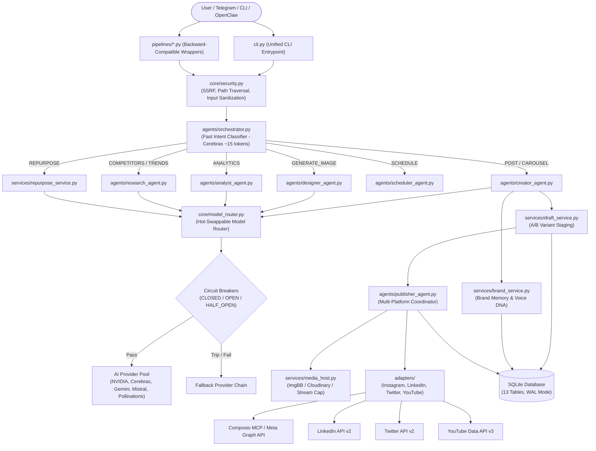
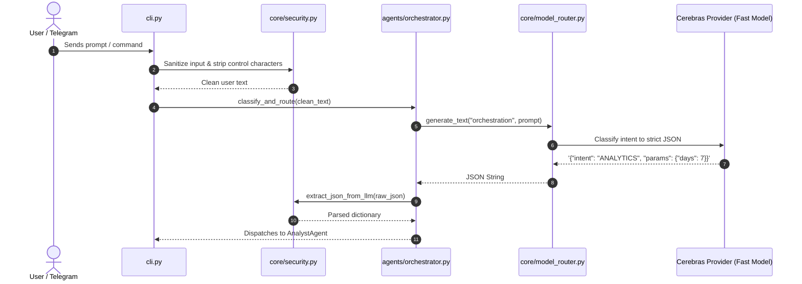
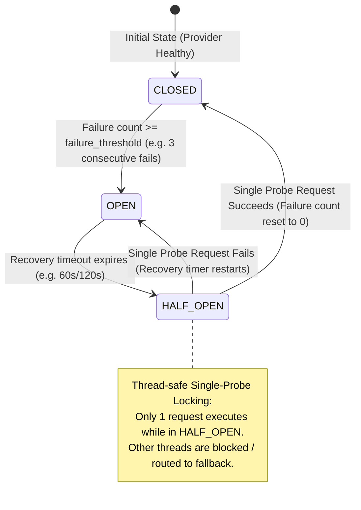
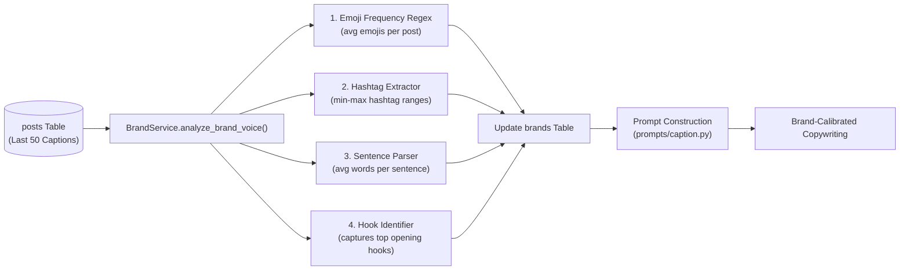
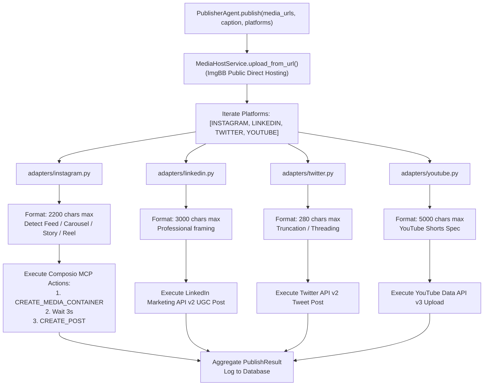
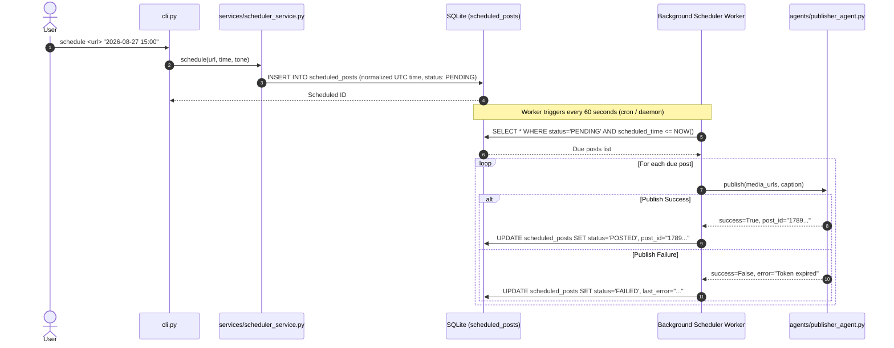
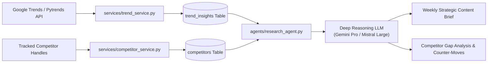
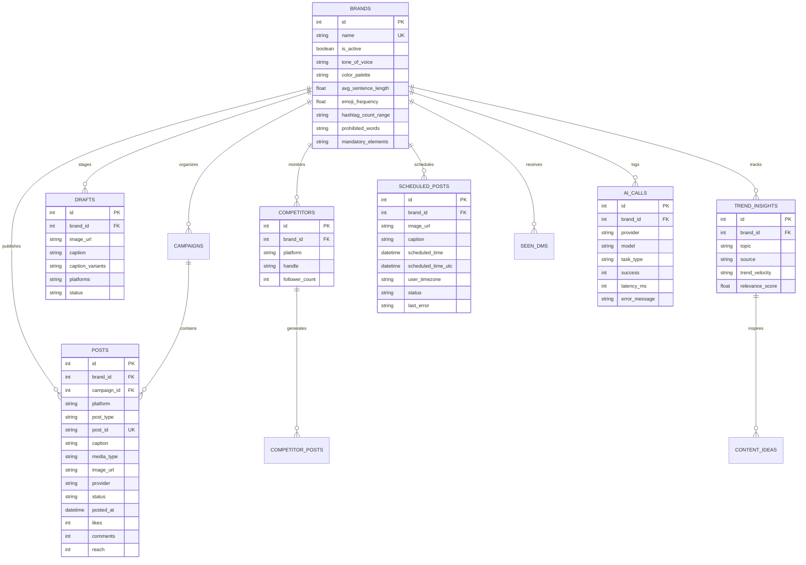

# ClawAgent v3.0 — Comprehensive Architecture & Technical Flowchart Handover

**Project Name:** ClawAgent (Social Media AI Operating System)  
**Document Purpose:** Engineering Team & Team Leader Handover Document  
**Version:** 3.0.0-Production  
**Author:** Swarit Sharma / Uniconverge Technologies Pvt. Ltd. (UCT)  
**Date:** 2026-08-27  

---

## Table of Contents
1. [Executive Summary & System Vision](#1-executive-summary--system-vision)
2. [End-to-End System Architecture Flowchart](#2-end-to-end-system-architecture-flowchart)
3. [Subsystem Flowcharts & Operational Sequences](#3-subsystem-flowcharts--operational-sequences)
   - 3.1 [Intent Classification & Dispatch Flow](#31-intent-classification--dispatch-flow)
   - 3.2 [Hot-Swappable Model Router & Circuit Breaker State Machine](#32-hot-swappable-model-router--circuit-breaker-state-machine)
   - 3.3 [Brand Memory & Voice Profiling Engine](#33-brand-memory--voice-profiling-engine)
   - 3.4 [Human-in-the-Loop Draft & Approval Lifecycle](#34-human-in-the-loop-draft--approval-lifecycle)
   - 3.5 [Multi-Platform Publishing Pipeline](#35-multi-platform-publishing-pipeline)
   - 3.6 [Scheduled Post Queue & Worker Lifecycle](#36-scheduled-post-queue--worker-lifecycle)
   - 3.7 [Competitor & Trend Intelligence Pipeline](#37-competitor--trend-intelligence-pipeline)
   - 3.8 [Security & Defense Perimeter](#38-security--defense-perimeter)
4. [Complete Codebase Map (What's Happening Where)](#4-complete-codebase-map-whats-happening-where)
5. [Database Architecture & Entity Relationship Diagram (ERD)](#5-database-architecture--entity-relationship-diagram-erd)
6. [Configuration Reference (`config/models.yaml` & `config/platforms.yaml`)](#6-configuration-reference)
7. [Developer Onboarding & Maintenance Checklist](#7-developer-onboarding--maintenance-checklist)

---

## 1. Executive Summary & System Vision

ClawAgent v3.0 is an autonomous, multi-agent social media operating system engineered to run **100% on free-tier AI APIs ($0/month)** while delivering enterprise-grade functionality:
- **Persistent Brand Memory**: Learns voice DNA (average sentence length, emoji frequency, hashtag patterns, and hooks) from past posts and enforces brand compliance.
- **Task-Based Model Routing with Hot-Reload**: Declaratively routes tasks to the best, fastest, and cheapest provider (Cerebras, NVIDIA NIM, Gemini Flash/Pro, Mistral, Pollinations, OpenRouter) with automatic circuit breaker isolation and zero-downtime YAML updates.
- **Multi-Platform Publishing**: Unified adapter layer supporting Instagram (Feed, Stories, Reels, Carousels), LinkedIn, X (Twitter), and YouTube Shorts.
- **Hardened Security Perimeter**: Built-in SSRF protection, path traversal defenses, secret redaction, and prompt sandboxing.

---

## 2. End-to-End System Architecture Flowchart



---

## 3. Subsystem Flowcharts & Operational Sequences

### 3.1 Intent Classification & Dispatch Flow

The Orchestrator classifies user prompts within ~200ms using a lightweight model or fast heuristic fallback.



---

### 3.2 Hot-Swappable Model Router & Circuit Breaker State Machine

Circuit breakers prevent cascading outages by isolating providers that return errors or timeouts.



---

### 3.3 Brand Memory & Voice Profiling Engine

The Brand Service extracts the brand's unique communication DNA from historical performance.



---

### 3.4 Human-in-the-Loop Draft & Approval Lifecycle

Posts go through an explicit staging and review lifecycle before publishing to live platforms.


---

### 3.5 Multi-Platform Publishing Pipeline

A unified publishing coordinator manages platform-specific formatting and media constraints.



---

### 3.6 Scheduled Post Queue & Worker Lifecycle



---

### 3.7 Competitor & Trend Intelligence Pipeline



---

### 3.8 Security & Defense Perimeter

Every inbound and outbound request is intercepted by defensive filters.

```mermaid
flowchart TD
    Inbound["Inbound Request (URL / Path / User Text)"] --> SecFilter["core/security.py"]
    
    SecFilter --> S1{"1. URL SSRF Filter\n(validate_safe_url)"}
    S1 -->|Private / Loopback / Cloud Metadata IP| Block1["Block with SecurityException\n(127.0.0.1, 169.254.169.254, RFC1918)"]
    S1 -->|Public Valid Domain| S2{"2. File Path Filter\n(validate_safe_file_path)"}
    
    S2 -->|Traversal / Sensitive File (.env, SSH)| Block2["Block with SecurityException"]
    S2 -->|Allowed Workspace Path| S3{"3. Payload Size Filter\n(safe_stream_download)"}
    
    S3 -->|> 25MB Limit| Block3["Abort Download (OOM Prevention)"]
    S3 -->|Valid Stream| S4{"4. Prompt Delimiter Filter\n(sanitize_user_input)"}
    
    S4 --> Process["Wrap in <user_input> XML Tags\nExecute Core Pipeline"]
    
    Process --> Outbound["Outbound Error / Log Filter"]
    Outbound --> Mask["mask_secrets()\nRedact sk-*, bot*, Bearer tokens"]
    Mask --> LogStorage[("Database / Log Files")]
```

---

## 4. Complete Codebase Map (What's Happening Where)

Here is the exact map of every folder, file, class, and method in the repository:

```
UCT_ag/
├── config/
│   ├── models.yaml                  # Model stack registry, rates, and fallback chains
│   └── platforms.yaml               # Platform adapter configurations & limits
│
├── core/
│   ├── __init__.py                  # Package marker
│   ├── circuit_breaker.py           # Thread-safe CircuitBreaker with single-probe locking
│   ├── config_loader.py             # YAML loader and optional watchdog file observer
│   ├── exceptions.py                # System-wide custom exceptions
│   ├── model_router.py              # Task-based router, fallback orchestrator, and status
│   └── security.py                  # SSRF, Path Traversal, Secret Masking, JSON Extractor
│
├── providers/
│   ├── __init__.py                  # Package marker
│   ├── base.py                      # ProviderClient abstract base class
│   ├── openai_compatible.py         # Client for Cerebras, NVIDIA NIM, Mistral, Ollama, OpenAI
│   ├── google_genai.py              # Google Gemini Flash (Vision) & Gemini Pro client
│   ├── pollinations.py              # Pollinations AI free image generation (Flux)
│   ├── replicate_provider.py        # Replicate paid upgrade client (Flux Schnell)
│   └── banana_provider.py           # Banana.dev paid upgrade client
│
├── adapters/
│   ├── __init__.py                  # Package marker
│   ├── base.py                      # PlatformAdapter interface, MediaSpec, PublishResult
│   ├── instagram.py                 # Composio / Meta Graph API Instagram adapter
│   ├── linkedin.py                  # LinkedIn Marketing API v2 adapter
│   ├── twitter.py                   # Twitter / X API v2 adapter
│   └── youtube.py                   # YouTube Data API v3 Shorts adapter
│
├── agents/
│   ├── __init__.py                  # Package marker
│   ├── orchestrator.py              # Fast intent classifier and specialist agent dispatcher
│   ├── creator_agent.py             # Brand-voiced caption & variant generator
│   ├── vision_agent.py              # Visual description and aesthetic extraction
│   ├── analyst_agent.py             # Performance analytics & strategic summary generator
│   ├── research_agent.py            # Competitor gap analysis & weekly trend briefs
│   ├── designer_agent.py            # AI image generator with brand styling
│   ├── scheduler_agent.py           # Optimal high-velocity time slot engine
│   └── publisher_agent.py           # Multi-platform publishing coordinator
│
├── services/
│   ├── __init__.py                  # Package marker
│   ├── brand_service.py             # Voice DNA extraction, profile CRUD, compliance check
│   ├── draft_service.py             # Draft staging, A/B variant generation, approval
│   ├── media_host.py                # ImgBB upload, media type detection, streaming download
│   ├── scheduler_service.py         # Scheduled post queue management & execution
│   ├── engagement_service.py        # DMs, comments, Telegram notifications, sentiment analysis
│   ├── trend_service.py             # Google Trends & niche signal monitoring
│   ├── competitor_service.py        # Competitor handle tracking & post logging
│   ├── repurpose_service.py         # Content repurposing (articles -> slides + tweets + video)
│   └── db_service.py                # Database inspection, storage stats, and maintenance
│
├── db/
│   ├── setup_db.py                  # SQLite DDL (13 tables) + auto column migration
│   ├── migrate.py                   # Migration utility for historical database files
│   ├── repository.py                # Central data repository with WAL mode & query whitelist
│   └── uct_agent.sqlite             # SQLite database file
│
├── prompts/
│   ├── __init__.py                  # Package marker
│   ├── caption.py                   # Brand-aware caption & carousel prompt templates
│   ├── analytics.py                 # Performance report interpretation prompts
│   ├── orchestrator.py              # Fast intent classification prompts
│   ├── competitor.py                # Competitive gap analysis prompts
│   └── trend.py                     # Viral trend synthesis prompts
│
├── pipelines/                       # Backward-compatible entrypoints for OpenClaw skills
│   ├── ai_router.py                 # Wrapper delegating to core.model_router & db.repository
│   ├── ig_connection.py             # Wrapper delegating to adapters.instagram
│   ├── post-with-caption.py         # Legacy single post wrapper
│   ├── post-carousel.py             # Legacy carousel wrapper
│   ├── preview.py                   # Legacy draft preview wrapper
│   ├── scheduler.py                 # Legacy scheduler wrapper
│   ├── generate-image.py            # Legacy image generation wrapper
│   ├── get-analytics.py             # Legacy analytics wrapper
│   ├── dm-comments.py               # Legacy DM & comment manager
│   ├── file_upload_handler.py       # Legacy local file upload wrapper
│   └── db_manager.py                # Legacy DB management wrapper
│
├── tests/
│   ├── test_security.py             # 14 automated security unit tests (SSRF, Traversal, Redaction)
│   └── test_edge_cases.py           # 10 automated edge-case unit tests (Circuit Breaker, Concurrency)
│
├── cli.py                           # Unified CLI entrypoint
├── setup.sh                         # Bootstrap & installation script
├── requirements.txt                 # Pinned Python dependencies
├── .env.example                     # Environment configuration template
├── .gitignore                       # Git ignore rules (DB, secrets, logs protected)
├── PRD.md                           # Product Requirements Document v3.0
├── SPEC_SHEET.md                    # Technical Specification Sheet v3.0
├── SKILLS.md                        # OpenClaw skills reference guide
└── README.md                        # Project overview and quickstart guide
```

---

## 5. Database Architecture & Entity Relationship Diagram (ERD)

The database consists of **13 relational tables** with Write-Ahead Logging (WAL) enabled:



---

## 6. Configuration Reference

### `config/models.yaml` Highlights
```yaml
version: 3
hot_reload: true
reload_interval_seconds: 5

defaults:
  orchestration: cerebras
  creative_writing: nvidia
  vision: gemini_flash
  reasoning: mistral
  deep_analysis: gemini_pro
  image_generation: pollinations
  fast_formatting: cerebras

fallback_chains:
  orchestration: [cerebras, gemini_flash, nvidia, mistral]
  creative_writing: [nvidia, mistral, gemini_flash, cerebras, openai]
  vision: [gemini_flash, openrouter, openai]
  reasoning: [mistral, gemini_pro, gemini_flash, openai]
  deep_analysis: [gemini_pro, mistral, openai]
  image_generation: [pollinations, banana_dev, replicate]
  fast_formatting: [cerebras, gemini_flash, nvidia]
```

---

## 7. Developer Onboarding & Maintenance Checklist

### Initial Setup (3 Minutes)
```bash
# 1. Clone repository & install dependencies
bash setup.sh

# 2. Copy and populate API keys
cp .env.example .env

# 3. Verify provider status & database
python cli.py ai-status
python cli.py db storage
```

### Running Test Suites
```bash
# Run full security test suite (14 tests)
python tests/test_security.py

# Run full edge-case & concurrency test suite (10 tests)
python tests/test_edge_cases.py
```

### Extending the Codebase
1. **Adding a New AI Provider**:
   - Create `providers/new_provider.py` subclassing `providers.base.ProviderClient`.
   - Register provider in `core/model_router.py` (`_get_provider_client`).
   - Add definition in `config/models.yaml` under `providers` and relevant `fallback_chains`.
2. **Adding a New Platform Adapter**:
   - Create `adapters/new_platform.py` subclassing `adapters.base.PlatformAdapter`.
   - Register in `agents/publisher_agent.py`.
   - Enable platform in `config/platforms.yaml`.
3. **Adding a New Prompt Skill**:
   - Create template builder in `prompts/new_skill.py` using `core.security.sanitize_user_input`.
   - Wire intent into `agents/orchestrator.py` and `cli.py`.

---

*Handover Document Completed. System is fully operational, hardened, and verified.*
