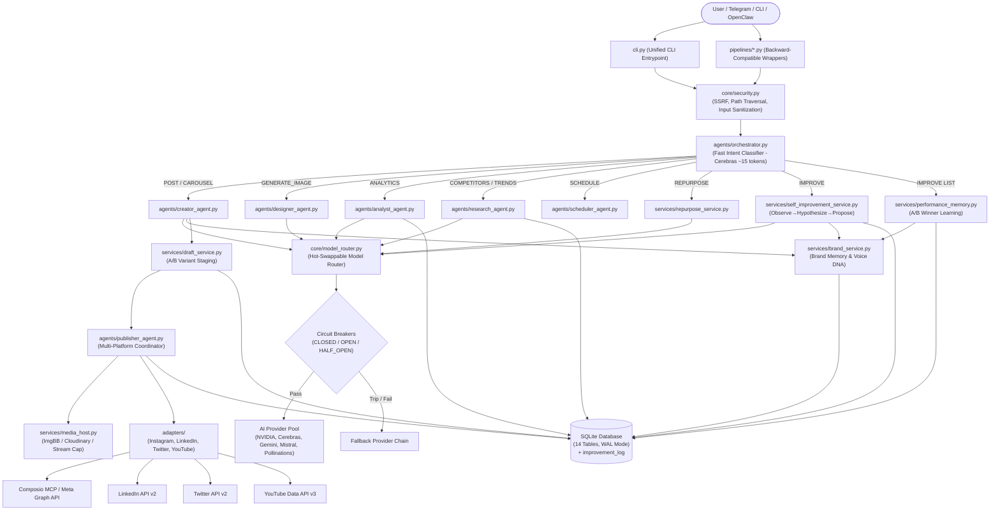
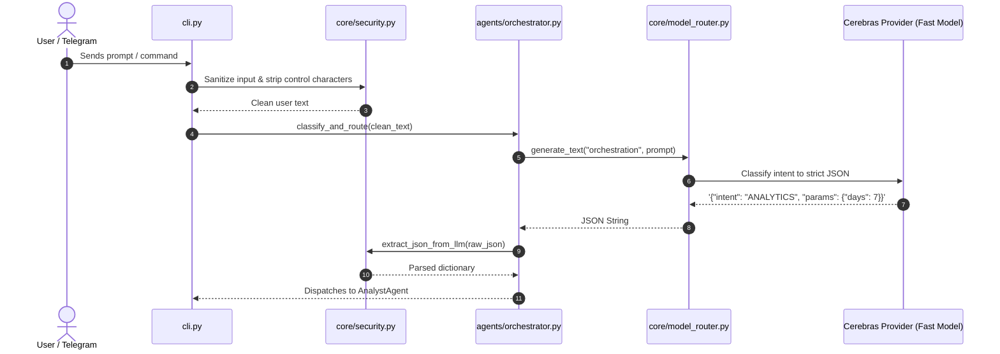
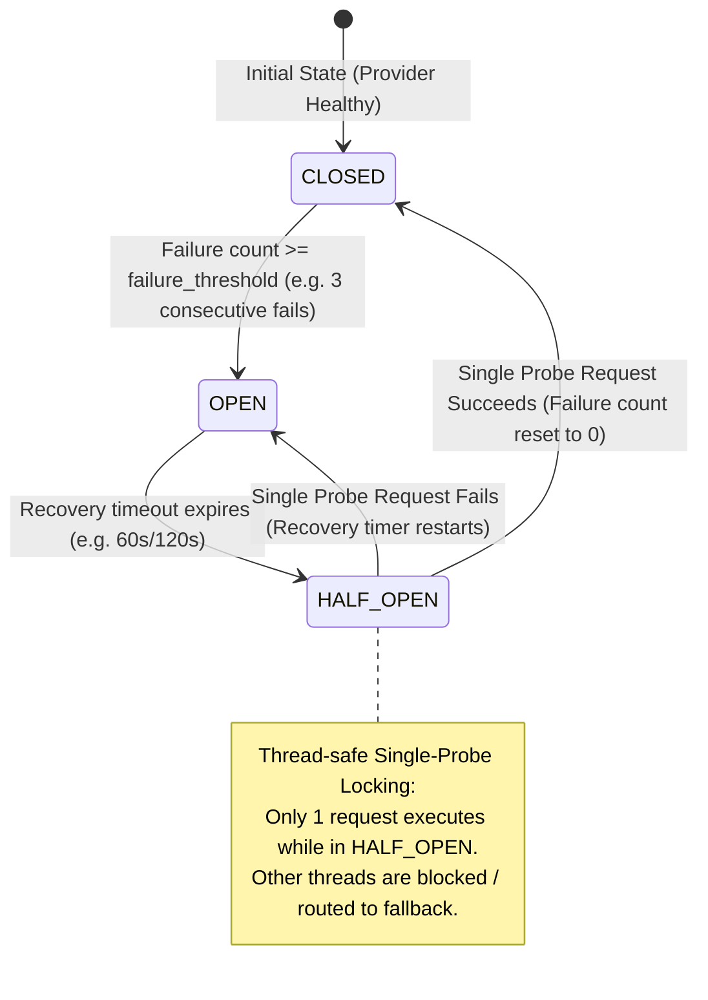
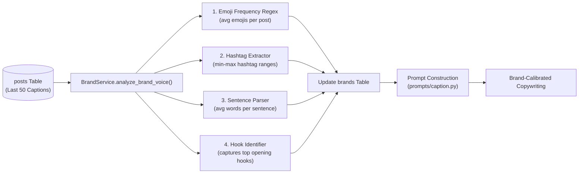
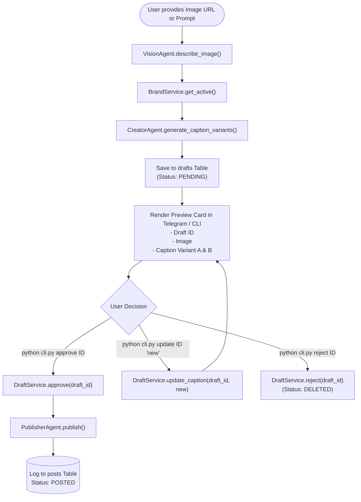
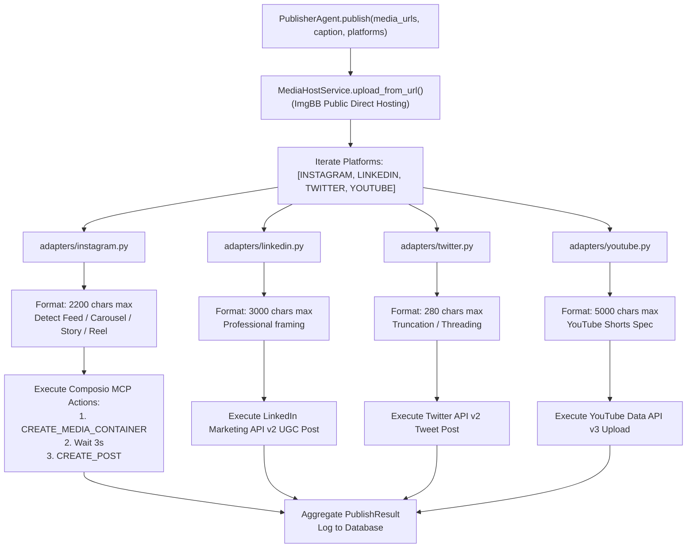
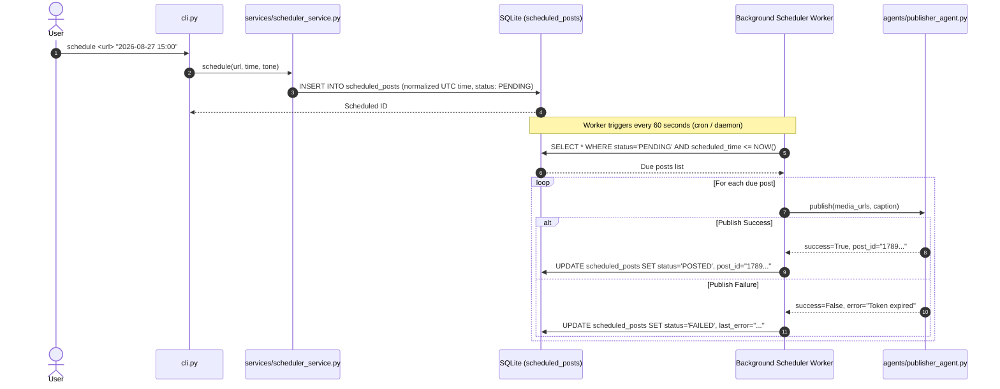
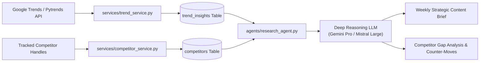
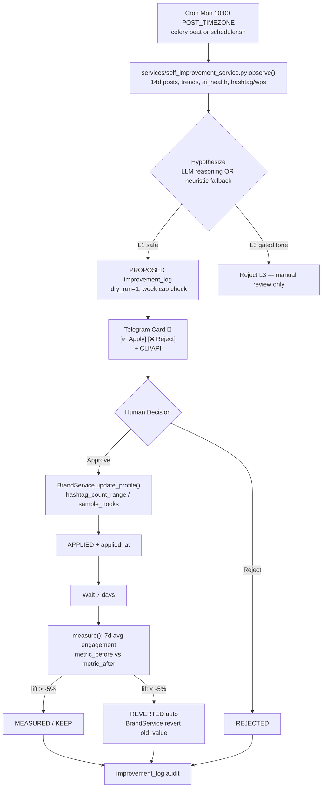

# ClawAgent v3.1 — Comprehensive Architecture & Technical Flowchart Handover — Self-Improving Loop

**Project Name:** ClawAgent (Social Media AI Operating System)  
**Document Purpose:** Engineering Team & Team Leader Handover Document  
**Version:** 3.1.0-Production — Self-Improving Loop  
**Author:** Swarit Sharma / Uniconverge Technologies Pvt. Ltd. (UCT)  
**Date:** 2026-08-28  

---

## Table of Contents
1. [Executive Summary & System Vision](#1-executive-summary--system-vision)
2. [End-to-End System Architecture Flowchart](#2-end-to-end-system-architecture-flowchart)
3. [Subsystem Flowcharts & Operational Sequences](#3-subsystem-flowcharts--operational-sequences)
   - 3.1 [Intent Classification & Dispatch Flow](#31-intent-classification--dispatch-flow)
   - 3.2 [Hot-Swappable Model Router & Circuit Breaker State Machine](#32-hot-swappable-model-router--circuit-breaker-state-machine)
   - 3.3 [Brand Memory & Voice Profiling Engine](#33-brand-memory--voice-profiling-engine)
   - 3.4 [Human-in-the-Loop Draft & Approval Lifecycle](#34-human-in-the-loop-draft--approval-lifecycle)
   - 3.5 [Multi-Platform Publishing Pipeline](#35-multi-platform-publishing-pipeline)
   - 3.6 [Scheduled Post Queue & Worker Lifecycle](#36-scheduled-post-queue--worker-lifecycle)
   - 3.7 [Competitor & Trend Intelligence Pipeline](#37-competitor--trend-intelligence-pipeline)
   - 3.8 [Security & Defense Perimeter](#38-security--defense-perimeter)
   - 3.9 [Self-Improving Loop (Observe→Hypothesize→Propose→Approve→Measure)](#39-self-improving-loop)
4. [Complete Codebase Map (What's Happening Where)](#4-complete-codebase-map-whats-happening-where)
5. [Database Architecture & Entity Relationship Diagram (ERD) — 14 Tables](#5-database-architecture--entity-relationship-diagram-erd)
6. [Configuration Reference (`config/models.yaml` & `config/platforms.yaml`)](#6-configuration-reference)
7. [Developer Onboarding & Maintenance Checklist](#7-developer-onboarding--maintenance-checklist)

---

## 1. Executive Summary & System Vision

ClawAgent v3.1 is an autonomous, multi-agent social media operating system engineered to run **100% on free-tier AI APIs ($0/month)** while delivering enterprise-grade functionality:
- **Persistent Brand Memory**: Learns voice DNA (average sentence length, emoji frequency, hashtag patterns, and hooks) from past posts and enforces brand compliance.
- **Task-Based Model Routing with Hot-Reload**: Declaratively routes tasks to the best, fastest, and cheapest provider (Cerebras, NVIDIA NIM, Gemini Flash/Pro, Mistral, Pollinations, OpenRouter) with automatic circuit breaker isolation and zero-downtime YAML updates.
- **Multi-Platform Publishing**: Unified adapter layer supporting Instagram (Feed, Stories, Reels, Carousels), LinkedIn, X (Twitter), and YouTube Shorts.
- **Hardened Security Perimeter**: Built-in SSRF protection, path traversal defenses, secret redaction, and prompt sandboxing.
- **Self-Improving Loop (v3.1)**: Weekly Observe→Hypothesize→Propose (dry-run, 1/week cap)→Human Approve→Measure (7d)→Keep/Revert. L1 safe fields (`hashtag_count_range`, `sample_hooks`) auto-proposable; L3 gated (`tone_of_voice`) never auto. All proposals audited in `improvement_log` for leader review. Uses `$0` `reasoning` chain or heuristic fallback.

---

## 2. End-to-End System Architecture Flowchart



---

## 3. Subsystem Flowcharts & Operational Sequences

### 3.1 Intent Classification & Dispatch Flow

The Orchestrator classifies user prompts within ~200ms using a lightweight model or fast heuristic fallback.



---

### 3.2 Hot-Swappable Model Router & Circuit Breaker State Machine

Circuit breakers prevent cascading outages by isolating providers that return errors or timeouts.



---

### 3.3 Brand Memory & Voice Profiling Engine

The Brand Service extracts the brand's unique communication DNA from historical performance.



---

### 3.4 Human-in-the-Loop Draft & Approval Lifecycle

Posts go through an explicit staging and review lifecycle before publishing to live platforms.



---

### 3.5 Multi-Platform Publishing Pipeline

A unified publishing coordinator manages platform-specific formatting and media constraints.



---

### 3.6 Scheduled Post Queue & Worker Lifecycle



---

### 3.7 Competitor & Trend Intelligence Pipeline



---

### 3.8 Security & Defense Perimeter

Every inbound and outbound request is intercepted by defensive filters.

```mermaid
flowchart TD
    Inbound["Inbound Request (URL / Path / User Text)"] --> SecFilter["core/security.py"]
    
    SecFilter --> S1{"1. URL SSRF Filter\n(validate_safe_url)"}
    S1 -->|Private / Loopback / Cloud Metadata IP| Block1["Block with SecurityException\n(127.0.0.1, 169.254.169.254, RFC1918)"]
    S1 -->|Public Valid Domain| S2{"2. File Path Filter\n(validate_safe_file_path)"}
    
    S2 -->|Traversal / Sensitive File (.env, SSH)| Block2["Block with SecurityException"]
    S2 -->|Allowed Workspace Path| S3{"3. Payload Size Filter\n(safe_stream_download)"}
    
    S3 -->|> 25MB Limit| Block3["Abort Download (OOM Prevention)"]
    S3 -->|Valid Stream| S4{"4. Prompt Delimiter Filter\n(sanitize_user_input)"}
    
    S4 --> Process["Wrap in <user_input> XML Tags\nExecute Core Pipeline"]
    
    Process --> Outbound["Outbound Error / Log Filter"]
    Outbound --> Mask["mask_secrets()\nRedact sk-*, bot*, Bearer tokens"]
    Mask --> LogStorage[("Database / Log Files")]
```

---

### 3.9 Self-Improving Loop (Observe→Hypothesize→Propose→Approve→Measure)

Weekly closed-loop that learns from outcomes without drifting brand voice. All changes dry-run, 1/week cap, human gate, auto-revert.



**Key invariants:**
- `improvement_log` `db/setup_db.py:220` single `PROPOSED/APPLIED` per `brand_id/week_number` — second `propose()` blocked.
- L1 fields `hashtag_count_range, sample_hooks, avg_sentence_length, emoji_frequency` `services/self_improvement_service.py:12` auto-proposable; L3 `tone_of_voice, prohibited_words` `services/self_improvement_service.py:13` rejected.
- $0: `router.generate_text(reasoning)` `core/model_router.py:127` via `mistral→gemini_pro` `config/models.yaml:152` or heuristic `_heuristic_proposal()` `services/self_improvement_service.py:90`.
- Telegram HITL `telegram/bot.py:98 handle_improve_command()` + `telegram/callbacks.py:120 improve_apply` + `telegram/keyboards.py:42 build_self_improve_keyboard`.
- API `api.py:44 POST /api/v3/self-improve/{id}/approve` Bearer gated `core/security.py:151`.
- CLI `cli.py:314 improve propose/list/approve/measure/history`.

---

## 4. Complete Codebase Map (What's Happening Where)

Here is the exact map of every folder, file, class, and method in the repository:

```
UCT_ag/
├── config/
│   ├── models.yaml                  # Model stack registry, rates, and fallback chains
│   └── platforms.yaml               # Platform adapter configurations & limits
│
├── core/
│   ├── __init__.py                  # Package marker
│   ├── circuit_breaker.py           # Thread-safe CircuitBreaker with single-probe locking
│   ├── config_loader.py             # YAML loader and optional watchdog file observer
│   ├── exceptions.py                # System-wide custom exceptions
│   ├── model_router.py              # Task-based router, fallback orchestrator, and status
│   └── security.py                  # SSRF, Path Traversal, Secret Masking, JSON Extractor
│
├── providers/
│   ├── __init__.py                  # Package marker
│   ├── base.py                      # ProviderClient abstract base class
│   ├── openai_compatible.py         # Client for Cerebras, NVIDIA NIM, Mistral, Ollama, OpenAI
│   ├── google_genai.py              # Google Gemini Flash (Vision) & Gemini Pro client
│   ├── pollinations.py              # Pollinations AI free image generation (Flux)
│   ├── replicate_provider.py        # Replicate paid upgrade client (Flux Schnell)
│   └── banana_provider.py           # Banana.dev paid upgrade client
│
├── adapters/
│   ├── __init__.py                  # Package marker
│   ├── base.py                      # PlatformAdapter interface, MediaSpec, PublishResult
│   ├── instagram.py                 # Composio / Meta Graph API Instagram adapter
│   ├── linkedin.py                  # LinkedIn Marketing API v2 adapter
│   ├── twitter.py                   # Twitter / X API v2 adapter
│   └── youtube.py                   # YouTube Data API v3 Shorts adapter
│
├── agents/
│   ├── __init__.py                  # Package marker
│   ├── orchestrator.py              # Fast intent classifier and specialist agent dispatcher
│   ├── creator_agent.py             # Brand-voiced caption & variant generator
│   ├── vision_agent.py              # Visual description and aesthetic extraction
│   ├── analyst_agent.py             # Performance analytics & strategic summary generator
│   ├── research_agent.py            # Competitor gap analysis & weekly trend briefs
│   ├── designer_agent.py            # AI image generator with brand styling
│   ├── scheduler_agent.py           # Optimal high-velocity time slot engine
│   └── publisher_agent.py           # Multi-platform publishing coordinator
│
├── services/
│   ├── __init__.py                  # Package marker
│   ├── brand_service.py             # Voice DNA extraction, profile CRUD, compliance check
│   ├── draft_service.py             # Draft staging, A/B variant generation, approval
│   ├── media_host.py                # ImgBB/Cloudinary/S3 upload, media type detection, SSRF guard
│   ├── scheduler_service.py         # Scheduled queue + weekly brief cache + self-improve triggers
│   ├── engagement_service.py        # DMs, comments, Telegram notifications, sentiment analysis
│   ├── trend_service.py             # Google Trends + X + IG hashtag, relevance scoring, TTL
│   ├── competitor_service.py        # Competitor handle tracking, sync, gap analysis (7d)
│   ├── repurpose_service.py         # Content repurposing v2: brand + platform limits + campaign persist
│   ├── db_service.py                # Database inspection, storage stats, and maintenance
│   ├── performance_memory.py        # A/B winner learning → sample_hooks bias
│   └── self_improvement_service.py  # Self-Improving Loop L1 (Observe→Hypothesize→Propose→Measure)
│
├── db/
│   ├── setup_db.py                  # SQLite DDL (14 tables, incl. improvement_log) + auto column migration
│   ├── migrate.py                   # Migration utility for historical database files
│   ├── repository.py                # Central repository WAL + Postgres optional + whitelist
│   └── uct_agent.sqlite             # SQLite database file (default solo, $0)
│
├── telegram/                        # Telegram HITL (v3.1)
│   ├── bot.py                       # Polling/Webhook, /improve, /brand, photo→draft
│   ├── keyboards.py                 # Draft 4-row + brand + analytics + self-improve cards
│   └── callbacks.py                 # approve/use_a/discard/brand_switch/improve_apply routing
│
├── .openclaw/skills/                # 7 OpenClaw skills (post, carousel, drafts, generate, analytics, dm, scheduler)
│
│
├── prompts/
│   ├── __init__.py                  # Package marker
│   ├── caption.py                   # Brand-aware caption & carousel prompt templates
│   ├── analytics.py                 # Performance report interpretation prompts
│   ├── orchestrator.py              # Fast intent classification prompts
│   ├── competitor.py                # Competitive gap analysis prompts
│   └── trend.py                     # Viral trend synthesis prompts
│
├── pipelines/                       # Backward-compatible entrypoints for OpenClaw skills
│   ├── ai_router.py                 # Wrapper delegating to core.model_router & db.repository
│   ├── ig_connection.py             # Wrapper delegating to adapters.instagram
│   ├── post-with-caption.py         # Legacy single post wrapper
│   ├── post-carousel.py             # Legacy carousel wrapper
│   ├── preview.py                   # Legacy draft preview wrapper
│   ├── scheduler.py                 # Legacy scheduler wrapper
│   ├── generate-image.py            # Legacy image generation wrapper
│   ├── get-analytics.py             # Legacy analytics wrapper
│   ├── dm-comments.py               # Legacy DM & comment manager
│   ├── file_upload_handler.py       # Legacy local file upload wrapper
│   └── db_manager.py                # Legacy DB management wrapper
│
├── tests/
│   ├── test_security.py             # 14 automated security unit tests (SSRF, Traversal, Redaction)
│   └── test_edge_cases.py           # 10 automated edge-case unit tests (Circuit Breaker, Concurrency)
│
├── cli.py                           # Unified CLI `post, carousel, preview, improve propose/list/approve/measure`
├── api.py                           # FastAPI: /health, /api/v3/models/status, /self-improve/*, /intelligence/*
├── celery_app.py                    # Celery beat: due-posts 60s, weekly brief Mon 9am, self-improve propose/measure
├── setup.sh                         # Bootstrap & installation script
├── requirements.txt                 # Pinned deps + optional psycopg2, redis, celery, cloudinary, python-telegram-bot
├── Dockerfile                       # Python 3.11 slim + healthcheck → uvicorn api:app
├── docker-compose.yml               # Team: agent+worker+beat+redis+postgres (solo: SQLite default)
├── .env.example                     # Templates: MEDIA_PROVIDER, DATABASE_URL, REDIS_URL, TELEGRAM_ALLOW_FROM, API_BEARER_TOKEN
├── .gitignore                       # Git ignore rules (DB, secrets, logs protected)
├── PRD.md                           # Product Requirements Document v3.1 — Self-Improving Loop
├── SPEC_SHEET.md                    # Technical Specification Sheet v3.1 — 14 tables, Self-Improving specs
├── SKILLS.md                        # OpenClaw skills reference guide (7 skills)
├── Planmuse.md                      # SDLC execution plan (S0-S4 + verification gates)
└── README.md                        # Project overview and quickstart guide
```

---

## 5. Database Architecture & Entity Relationship Diagram (ERD) — 14 Tables (v3.1)

The database consists of **14 relational tables** (13 + `improvement_log` self-improving audit) with Write-Ahead Logging (WAL) enabled:

```mermaid
erDiagram
    BRANDS ||--o{ CAMPAIGNS : organizes
    BRANDS ||--o{ POSTS : publishes
    BRANDS ||--o{ DRAFTS : stages
    BRANDS ||--o{ COMPETITORS : monitors
    BRANDS ||--o{ TREND_INSIGHTS : tracks
    BRANDS ||--o{ SCHEDULED_POSTS : schedules
    BRANDS ||--o{ SEEN_DMS : receives
    BRANDS ||--o{ AI_CALLS : logs
    BRANDS ||--o{ IMPROVEMENT_LOG : improves (v3.1)
    
    COMPETITORS ||--o{ COMPETITOR_POSTS : generates
    TREND_INSIGHTS ||--o{ CONTENT_IDEAS : inspires
    CAMPAIGNS ||--o{ POSTS : contains

    BRANDS {
        int id PK
        string name UK
        boolean is_active
        string tone_of_voice
        string color_palette
        float avg_sentence_length
        float emoji_frequency
        string hashtag_count_range
        string prohibited_words
        string mandatory_elements
    }

    POSTS {
        int id PK
        int brand_id FK
        int campaign_id FK
        string platform
        string post_type
        string post_id UK
        string caption
        string media_type
        string image_url
        string provider
        string status
        datetime posted_at
        int likes
        int comments
        int reach
    }

    DRAFTS {
        int id PK
        int brand_id FK
        string image_url
        string caption
        string caption_variants
        string platforms
        string status
    }

    SCHEDULED_POSTS {
        int id PK
        int brand_id FK
        string image_url
        string caption
        datetime scheduled_time
        datetime scheduled_time_utc
        string user_timezone
        string status
        string last_error
    }

    COMPETITORS {
        int id PK
        int brand_id FK
        string platform
        string handle
        int follower_count
    }

    TREND_INSIGHTS {
        int id PK
        int brand_id FK
        string topic
        string source
        string trend_velocity
        float relevance_score
    }

    AI_CALLS {
        int id PK
        int brand_id FK
        string provider
        string model
        string task_type
        int success
        int latency_ms
        string error_message
    }

    IMPROVEMENT_LOG {
        int id PK
        int brand_id FK
        int week_number
        string experiment_type
        string changed_field
        string old_value
        string new_value
        float metric_before
        float metric_after
        float predicted_lift
        string status
        boolean dry_run
    }
```

---

## 6. Configuration Reference

### `config/models.yaml` Highlights
```yaml
version: 3
hot_reload: true
reload_interval_seconds: 5

defaults:
  orchestration: cerebras
  creative_writing: nvidia
  vision: gemini_flash
  reasoning: mistral
  deep_analysis: gemini_pro
  image_generation: pollinations
  fast_formatting: cerebras

fallback_chains:
  orchestration: [cerebras, gemini_flash, nvidia, mistral]
  creative_writing: [nvidia, mistral, gemini_flash, cerebras, openai]
  vision: [gemini_flash, openrouter, openai]
  reasoning: [mistral, gemini_pro, gemini_flash, openai]
  deep_analysis: [gemini_pro, mistral, openai]
  image_generation: [pollinations, banana_dev, replicate]
  fast_formatting: [cerebras, gemini_flash, nvidia]
```

---

## 7. Developer Onboarding & Maintenance Checklist

### Initial Setup (3 Minutes)
```bash
# 1. Clone repository & install dependencies
bash setup.sh

# 2. Copy and populate API keys
cp .env.example .env

# 3. Verify provider status & database
python cli.py ai-status
python cli.py db storage
```

### Running Test Suites
```bash
# Run full security test suite (14 tests)
python tests/test_security.py

# Run full edge-case & concurrency test suite (10 tests)
python tests/test_edge_cases.py

# Verify self-improving loop (dry-run → approve → measure)
python cli.py improve propose
python cli.py improve list
python cli.py improve approve 1
python cli.py improve measure 1
python cli.py improve history
```

### Verifying the Loops (Leader Gates)
```bash
# G-S0 foundation
python db/setup_db.py && python cli.py ai-status && python cli.py db storage
# G-S1 intelligence
python cli.py trends && python cli.py competitors --brief && python cli.py ideas --force
# G-S2 HILT Telegram
python cli.py preview "https://picsum.photos/200" --tone casual
# G-S3 advanced
python cli.py repurpose "Long article text for repurposing test..."
python -c "from services.performance_memory import PerformanceMemory; print(PerformanceMemory().update_brand_hooks_from_winners())"
# G-S4 scale
python -c "from fastapi.testclient import TestClient; import api; c=TestClient(api.app); print(c.get('/api/v3/health').json())"
# G-S5 self-improve (v3.1)
python cli.py improve propose && python cli.py improve history
curl http://localhost:8080/api/v3/self-improve/pending  # via FastAPI
```

### Extending the Codebase
1. **Adding a New AI Provider**:
   - Create `providers/new_provider.py` subclassing `providers.base.ProviderClient`.
   - Register provider in `core/model_router.py` (`_get_provider_client`).
   - Add definition in `config/models.yaml` under `providers` and relevant `fallback_chains`.
2. **Adding a New Platform Adapter**:
   - Create `adapters/new_platform.py` subclassing `adapters.base.PlatformAdapter`.
   - Register in `agents/publisher_agent.py`.
   - Enable platform in `config/platforms.yaml`.
3. **Adding a New Prompt Skill**:
   - Create template builder in `prompts/new_skill.py` using `core.security.sanitize_user_input`.
   - Wire intent into `agents/orchestrator.py` and `cli.py`.
4. **Adding a Self-Improvement Experiment**:
   - Extend `ALLOWED_FIELDS` `services/self_improvement_service.py:12` (L1) — add new brand field.
   - Implement heuristic in `_heuristic_proposal()` `services/self_improvement_service.py:90` for fallback.
   - Add Telegram card row `telegram/keyboards.py:42` and callback `telegram/callbacks.py:120`.
   - Register API `api.py:44` and CLI `cli.py:314` and beat `celery_app.py:31`.

---

*Handover Document v3.1 Completed — Self-Improving Loop audited. System is fully operational, hardened, and verified: 14 tables WAL, 7 OpenClaw skills, 8 FastAPI endpoints + 6 self-improve endpoints, Telegram HITL for drafts + self-improve, Celery/Redis optional scale, $0 default.*
